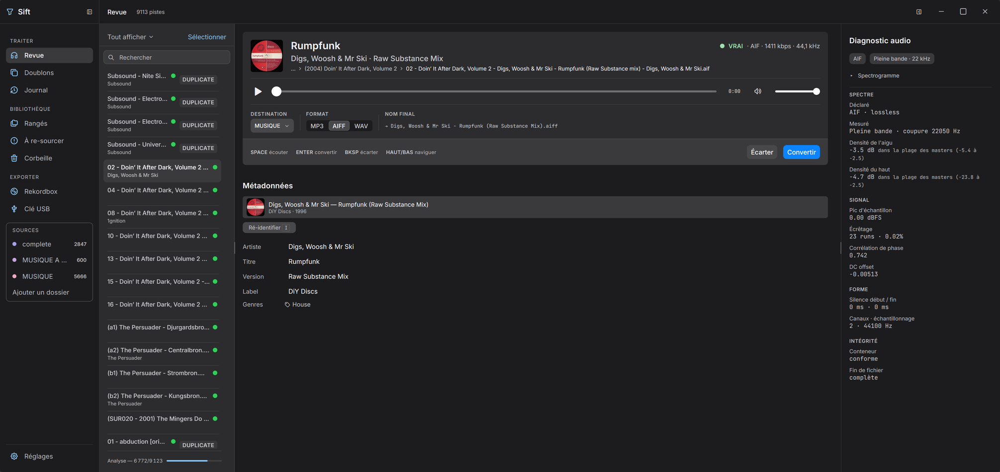

# Sift

**Le poste de prépa entre tes téléchargements et les platines.**
App desktop gratuite pour DJ, Windows et macOS. Sift écoute chaque fichier qui arrive, dit s'il
est vraiment lossless, repère les doublons, le range au bon format au bon endroit, puis pousse
la bibliothèque vers Rekordbox et sur une clé USB.

Une seule règle : **déplacer, c'est encoder et ranger**. Rien n'est supprimé sans que tu le
demandes, et un dossier surveillé n'est jamais réécrit.

## Télécharger

[**Dernière version →**](https://github.com/c0remusic/sift/releases/latest)

| Machine | Fichier |
|---|---|
| Windows | `Sift_<version>_x64-setup.exe` |
| Mac Apple Silicon (M1 et suivants) | `Sift_<version>_aarch64.dmg` |
| Mac Intel | `Sift_<version>_x64.dmg` |

Les builds ne sont pas signés : le système avertit au premier lancement, une seule fois.
Quoi cliquer, selon le message : [`docs/install-non-signe.md`](docs/install-non-signe.md).
Les versions suivantes arrivent par la mise à jour automatique, depuis l'app.

## Manuel

- **En ligne, dans le design de l'app :** https://sift-music.vercel.app/manuel.html
- **En PDF :** https://sift-music.vercel.app/manuel.pdf
- En Markdown : [`docs/manuel.md`](docs/manuel.md)

Installer, trois mots à connaître, les neuf écrans, le clavier, et ce que la détection laisse
passer.

## Ce que Sift fait

- **Détecte les faux lossless** — un FLAC, WAV ou AIFF dont le contenu est passé par du MP3,
  de l'AAC ou de l'Opus. Trois mesures (coupure du spectre, platitude de l'aigu, trace du
  codec dans les échantillons) et un verdict en un mot : **VRAI**, **FAUX**, **À VÉRIFIER**.
  Aucun fichier authentique n'est accusé ; une partie des transcodages haut débit passe encore
  (MP3 320 et V0, AAC 128), et un chantier est ouvert pour les attraper.
- **Écoute d'abord** — lecteur, forme d'onde, spectrogramme ; on écoute, puis on tranche.
- **Range en convertissant** — MP3, WAV ou AIFF au format des platines, nommé depuis les
  tags, dans l'arbre de ta bibliothèque. Doublons et déjà-rangés signalés avant.
- **Identifie sur Discogs** — artiste, titre, label, année, genre, pochette.
- **Rekordbox** — une synchronisation, par XML ou directement dans `master.db`, avec
  sauvegarde vérifiée avant toute écriture.
- **Clé USB** — formatage FAT32 même au-delà de 32 Go, éjection propre.
- **Tout se défait** — un journal de chaque action, avec retour en arrière.

## Un problème ?

Les erreurs s'affichent dans l'app avec leur cause. Pour signaler :
[github.com/c0remusic/sift/issues](https://github.com/c0remusic/sift/issues) — la version, la
machine, et ce qui était attendu. Faille de sécurité : [`SECURITY.md`](SECURITY.md).

## Pour construire

Tauri v2 (Rust) + Vite / TypeScript vanilla. Tout est dans
[`docs/developpement.md`](docs/developpement.md) : pile, prérequis, commandes, structure, CI et
release. Conventions et architecture détaillée : [`CLAUDE.md`](CLAUDE.md). Nouveautés par version :
[`CHANGELOG.md`](CHANGELOG.md).

Sift est un logiciel propriétaire : le code est consultable, son usage est encadré par la
[licence](LICENSE). Les versions jusqu'à la v0.1.2 incluse restent sous MIT.
